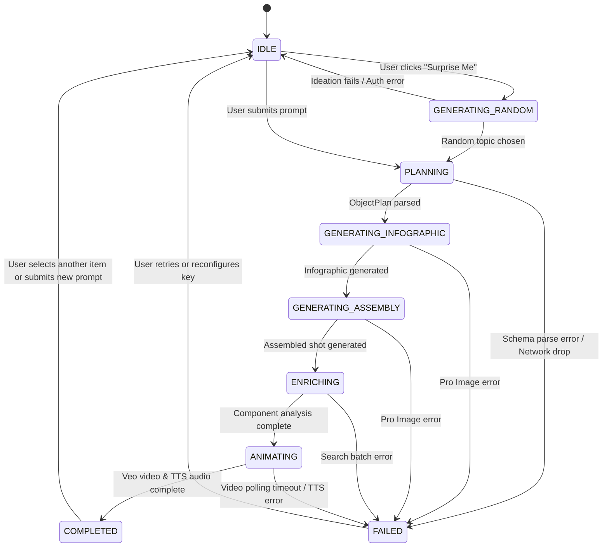

# User Flows & Generation Pipeline State Machine

## Overview
ExplodeIt guides users through an educational exploration lifecycle that balances progressive visual disclosure with asynchronous multi-model processing. The state machine managed by `App.tsx` guarantees that intermediate artifacts (blueprints, diagrams, assembled shots, deep articles) appear incrementally in the UI as soon as each model execution completes.

## State Machine Transition Graph

## Primary User Flows

### 1. Manual Exploration Flow
1. User enters a query (e.g., "Vintage SLR Camera", "Relational Database Engine", "Bioluminescent Jellyfish") into `InputArea.tsx`.
2. User toggles the "Animate" checkbox (enabled by default; triggers Veo 3.1 video generation).
3. Clicking "Explode It" initializes a new `GenerationItem` in history and transitions status to `PLANNING`.
4. As each stage finishes, UI state updates reactively:
   - **`PLANNING`**: Displays dynamic title, domain category badge, and placeholder component cards.
   - **`GENERATING_INFOGRAPHIC`**: Renders high-fidelity exploded diagram in the right display slot.
   - **`GENERATING_ASSEMBLY`**: Renders the complete assembled product shot in the left display slot.
   - **`ENRICHING`**: Replaces placeholder cards with rich component composition summaries and citations.
   - **`ANIMATING`**: Concurrent rendering of Veo 3.1 MP4 video (replaces left slot) and TTS audio guide.
   - **`COMPLETED`**: Audio player header unlocks; full encyclopedia article and trivia render below.

### 2. "Surprise Me" Ideation Flow
1. User clicks the "Surprise Me" button.
2. System transitions to `GENERATING_RANDOM` and calls `getRandomObject()` using `gemini-2.5-flash` with temperature `1.3` and a random seed.
3. Once an interesting object name is generated, the pipeline automatically chains into `handleGenerate(name, withVideo)`.

### 3. Component Deep Dive Flow
1. In `DisplayArea.tsx`, user clicks any component card from the "Component Anatomy" grid.
2. An overlay modal renders containing:
   - Material / Composition attribute.
   - Short synopsis.
   - Comprehensive multi-paragraph in-depth technical explanation (`detailedContent`).
   - Verified Google Search Grounding sources with direct outbound domain links.

### 4. Audio Narration & Video Fullscreen Flows
- **Audio Tour**: Clicking the Play/Pause button in the header streams synthesized audio guide commentary generated by Gemini TTS. A restart button rewinds audio playback to the start.
- **Media Expansion**: Clicking the exploded view or assembled shot opens a modal zoom preview with a 1-click "Download HD" option. Clicking the Veo video opens a video player modal with "Download Video".

### 5. API Key Configuration & Rotation
- When first accessing the app with empty `localStorage`, the user is greeted with a blocking splash modal (`ApiKeyModal.tsx`).
- At any time during the session, users can click "Update API Key" in the sidebar to enter a new key, or "Clear Key" to purge credentials and return to splash mode.
