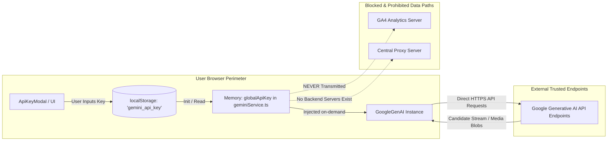

# Bring-Your-Own-Key (BYOK) Client-Side Security Model

## Overview
ExplodeIt is engineered as an open, decentralized client-side tool adhering strictly to the **Bring-Your-Own-Key (BYOK)** paradigm. The application eliminates the requirement for centralized server proxy infrastructure, removing hosting API cost liabilities and ensuring user credentials remain within the user's personal browser perimeter.

## Security Boundary & Threat Model



## Credential Storage & Lifecycle

### 1. In-Browser Persistence (`localStorage`)
- The API key is persisted locally in the browser's origin-scoped `localStorage` under the key `gemini_api_key`.
- It is never written to cookies, indexed DB, or shared workers.
- The key is scoped exclusively to the application origin (domain and port).

### 2. Runtime In-Memory State (`services/geminiService.ts`)
- An in-memory variable `let globalApiKey = process.env.API_KEY || ""` manages runtime calls.
- Calling `setGlobalApiKey(key)` mutates this reference immediately for downstream calls.
- Calling `handleClearKey()` in `App.tsx` performs an immediate dual-wipe:
  1. `localStorage.removeItem('gemini_api_key')`
  2. `setGlobalApiKey("")`
  3. Resets component state `apiKey` to `null` and opens the splash barrier.

### 3. Non-Persistence & Telemetry Isolation
- **Google Analytics 4 Isolation**: `services/analytics.ts` tracks operational events (model name, generation step, status, latency), but **strictly excludes** API keys, authorization tokens, or user prompt queries.
- **Zero Intermediary Proxies**: Calls from `GoogleGenAI` invoke Google's official endpoints (`generativelanguage.googleapis.com`) directly via standard TLS encryption.

## Authentication Failure Handling & Recovery

When an API call fails with HTTP status 401, 403, or invalid credential messages, the error handling pipeline in `App.tsx` intercepts the response:
```typescript
if (msg.includes("401") || msg.includes("API key") || msg.includes("403")) {
    setError("Invalid API Key. Please check your key and try again.");
    setIsModalOpen(true); // Re-opens configuration modal
    setStatus(GenerationStatus.FAILED);
    return;
}
```
This halts recursive retry loops immediately, alerts the user, and prompts for a valid API key.
