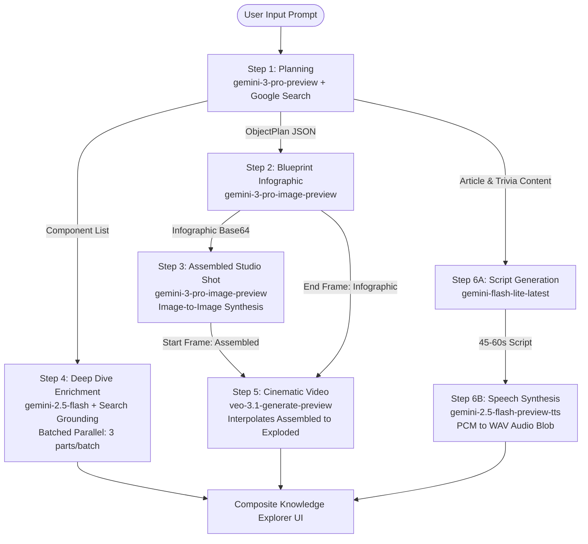

# Multi-Model Generative AI Pipeline Architecture

## Overview
ExplodeIt implements a multi-model orchestration pipeline where five distinct foundation models collaborate to deconstruct any physical, biological, software, or conceptual topic. Rather than executing a monolithic single-prompt generation, ExplodeIt splits generation into specialized phases where each model operates at its peak capability (reasoning, image synthesis, search grounding, temporal animation, and speech synthesis).

## Orchestration Architecture Flow

## Detailed Pipeline Phases

### Phase 1: Blueprint Structuring (`planObject`)
- **Model**: `gemini-3-pro-preview`
- **Configuration**: `tools: [{ googleSearch: {} }]`, `responseMimeType: "application/json"`, and strict `responseSchema: PlanSchema`.
- **Function**: Classifies the query into domain types (`PHYSICAL`, `SOFTWARE`, `CONCEPTUAL`, `BIOLOGICAL`, `OTHER`), selects a visualization metaphor (e.g., "Exploded View", "System Architecture Diagram"), generates dynamic section headers, crafts an origin story and an 800-word comprehensive markdown article, identifies 6-8 core components, and selects a tailored TTS voice persona (`Puck`, `Charon`, `Kore`, `Fenrir`, or `Zephyr`).

### Phase 2: Blueprint Infographic (`generateInfographic`)
- **Model**: `gemini-3-pro-image-preview`
- **Configuration**: Aspect ratio `16:9`, resolution `2K`.
- **Function**: Generates the exploded visual deconstruction showing floating internal components, leader lines, and labeled subsystems matching the visual style prompt synthesized in Phase 1.

### Phase 3: Assembled Product Studio Shot (`generateAssembledImage`)
- **Model**: `gemini-3-pro-image-preview` (Multimodal Image-to-Image)
- **Input**: Text prompt + previous exploded infographic base64 image data.
- **Function**: Synthesizes the closed, intact, complete version of the object sitting on a surface (or a holographic dashboard for software), maintaining strict aesthetic and material consistency with the exploded view.

### Phase 4: Batched Component Deep Dive (`enrichComponentDetails`)
- **Model**: `gemini-2.5-flash` with Google Search Grounding
- **Parallel Strategy**: The component list is split into chunks of `BATCH_SIZE = 3`. Batches execute concurrently via `Promise.all`.
- **Search Citation Cleansing**: Grounding metadata chunks from `response.candidates[0].groundingMetadata.groundingChunks` are extracted. Internal Google infrastructure domains (`google.com`, `vertexaisearch`, `googleusercontent`) are stripped to retain authentic external educational citations.

### Phase 5: Cinematic Video Generation (`generateVideo`)
- **Model**: `veo-3.1-generate-preview`
- **Motion Interpolation**: Uses the assembled product render as the starting frame (`imageBytes`) and the exploded infographic render as the ending frame (`lastFrame`).
- **Polling Loop**: Veo generates asynchronously; the service polls `ai.operations.getVideosOperation` every 5 seconds until `operation.done === true`.
- **Asset Materialization**: The resulting MP4 video is fetched via authenticated endpoint, converted into an in-memory `Blob`, and assigned a browser `blob:` URL.

### Phase 6: Scripting & Speech Synthesis (`generateAudioNarration`)
- **Script Generation**: `gemini-flash-lite-latest` synthesizes a concise 45-60 second spoken narrative script structured around the Hook, Mechanics, and Impact.
- **Audio Synthesis**: `gemini-2.5-flash-preview-tts` generates raw PCM audio (`responseModalities: [Modality.AUDIO]`) utilizing the persona voice selected in Phase 1.
- **WAV Packaging**: A client-side helper (`getWavHeader`) prepends a 44-byte RIFF/WAVE header (24kHz, 16-bit, mono) to the PCM byte buffer, producing a standard WAV `Blob` playable in native `<audio>` elements.

### Concurrency & Parallelism
Steps 5 (Veo Video) and 6 (TTS Audio) run concurrently inside `App.tsx` using `Promise.all([generateVideo(...), generateAudioNarration(...)])`, significantly minimizing the total turnaround time before the entry reaches `COMPLETED` status.
