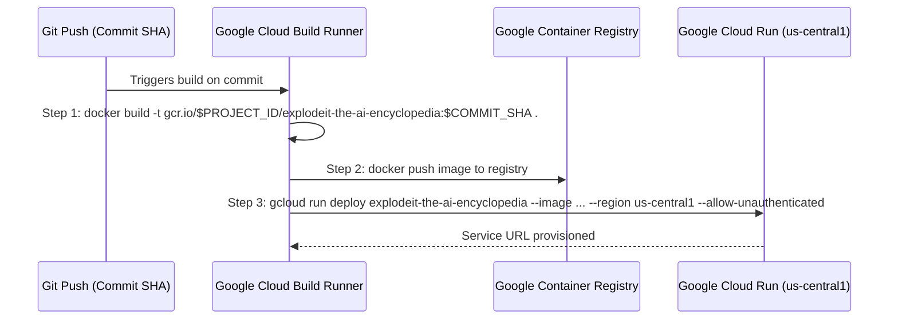

# Continuous Integration & Deployment (Cloud Build & GitHub Pages)

## Overview
ExplodeIt features two complementary automated deployment pipelines designed for different operational targets:
1. **Google Cloud Build**: An automated container build and deployment pipeline targeting Google Cloud Run.
2. **GitHub Actions (`gh-pages.yml`)**: A lightweight continuous deployment pipeline compiling and publishing static distribution bundles to GitHub Pages.

## 1. Cloud Build Container Pipeline (`cloudbuild.yaml`)



### Pipeline Steps:
```yaml
steps:
  # Build the container image
  - name: 'gcr.io/cloud-builders/docker'
    args: ['build', '-t', 'gcr.io/$PROJECT_ID/explodeit-the-ai-encyclopedia:$COMMIT_SHA', '.']
  # Push the container image to Container Registry
  - name: 'gcr.io/cloud-builders/docker'
    args: ['push', 'gcr.io/$PROJECT_ID/explodeit-the-ai-encyclopedia:$COMMIT_SHA']
  # Deploy container image to Cloud Run
  - name: 'gcr.io/google.com/cloudsdktool/cloud-sdk'
    entrypoint: gcloud
    args:
      - 'run'
      - 'deploy'
      - 'explodeit-the-ai-encyclopedia'
      - '--image'
      - 'gcr.io/$PROJECT_ID/explodeit-the-ai-encyclopedia:$COMMIT_SHA'
      - '--region'
      - 'us-central1'
      - '--allow-unauthenticated'
images:
  - 'gcr.io/$PROJECT_ID/explodeit-the-ai-encyclopedia:$COMMIT_SHA'
```

### Key Operational Characteristics:
- **Immutable Container Tagging**: Images are tagged with `$COMMIT_SHA` to allow instantaneous zero-downtime rollbacks to previous versions.
- **Serverless Ingress**: Deploys with `--allow-unauthenticated`, allowing public global access while delegating authentication to client-side BYOK key management.

## 2. GitHub Pages Static Pipeline (`.github/workflows/gh-pages.yml`)

For serverless static hosting without container runtime overhead, ExplodeIt integrates a native GitHub Actions workflow:

### Workflow Workflow Architecture:
1. **Trigger Event**: Pushes to branch `main`.
2. **Setup Phase**: Provisions `actions/checkout@v4` and `actions/setup-node@v4` with Node.js version 20.
3. **Compilation**:
   - Executes clean dependency installation via `npm ci`.
   - Executes Vite bundle generation via `npm run build`.
4. **Artifact Publishing**:
   - Deploys `dist/` directory via `actions/upload-pages-artifact@v3`.
   - Mounts static site to the GitHub Pages edge CDN via `actions/deploy-pages@v4`.
5. **Path Compatibility**: Leverages Vite's `base: './'` configuration to ensure relative asset URLs load reliably under GitHub Pages repository subpaths (`https://<username>.github.io/<repo>/`).
