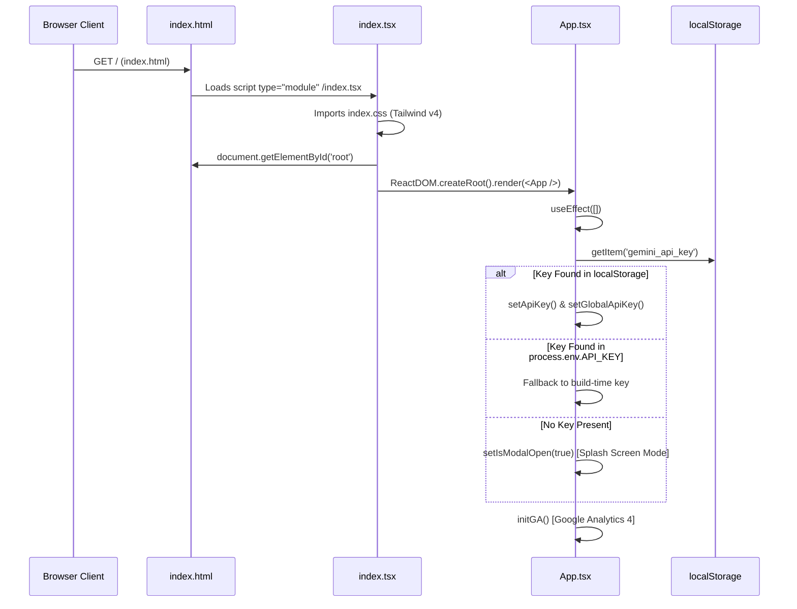

# Application Entry Points & Bootstrapping

## Overview
ExplodeIt uses a standard Vite modern browser entrypoint architecture with zero server-side rendering. Execution begins at `index.html`, resolves through `index.tsx`, and transfers lifecycle control to `App.tsx`.

## Entry Point Sequence



## 1. Document Skeleton (`index.html`)
The root HTML file provides the mounting container and asset links:
- **Encoding & Viewport**: Standard UTF-8 with dynamic responsive viewport `width=device-width, initial-scale=1.0`.
- **Favicon**: Linked to `public/favicon.svg` with SVG mime-type support.
- **Root Container**: `<div id="root"></div>` provides the target container for React 19 hydration.
- **Module Execution**: `<script type="module" src="/index.tsx"></script>` initiates ECMAScript module resolution.

## 2. React 19 Hydration (`index.tsx`)
The React mounting script imports global CSS styling and binds the React virtual DOM tree:
```typescript
import React from 'react';
import ReactDOM from 'react-dom/client';
import App from './App';
import './index.css';

const rootElement = document.getElementById('root');
if (!rootElement) {
  throw new Error("Could not find root element to mount to");
}

const root = ReactDOM.createRoot(rootElement);
root.render(
  <React.StrictMode>
    <App />
  </React.StrictMode>
);
```

### Key Technical Details:
- **`ReactDOM.createRoot`**: Uses React 18/19 concurrent rendering primitives.
- **`React.StrictMode`**: Enforces strict mode assertions in development, ensuring pure render functions and idempotent effects.
- **Global CSS Import**: `./index.css` is injected at root level, providing `@import "tailwindcss";` directives.

## 3. Application Lifecycle Bootstrapping (`App.tsx`)
Upon initial component mount (`useEffect` with empty dependency array `[]`), `App.tsx` performs two foundational bootstrap operations:

1. **`initializeApiKey()` Flow**:
   - Queries `localStorage.getItem('gemini_api_key')`.
   - If present, populates state `apiKey` and calls `setGlobalApiKey(storedKey)`.
   - If absent, checks compile-time `process.env.API_KEY`.
   - If both are empty, activates the modal state `isModalOpen = true` with `isSplash = true`, halting unauthorized generation operations until credentials are provided.

2. **`initGA()` Flow**:
   - Initializes Google Analytics 4 via `react-ga4` using the configured measurement identifier.
   - Suppresses errors gracefully if network tracking is blocked by adblockers or privacy configurations.
