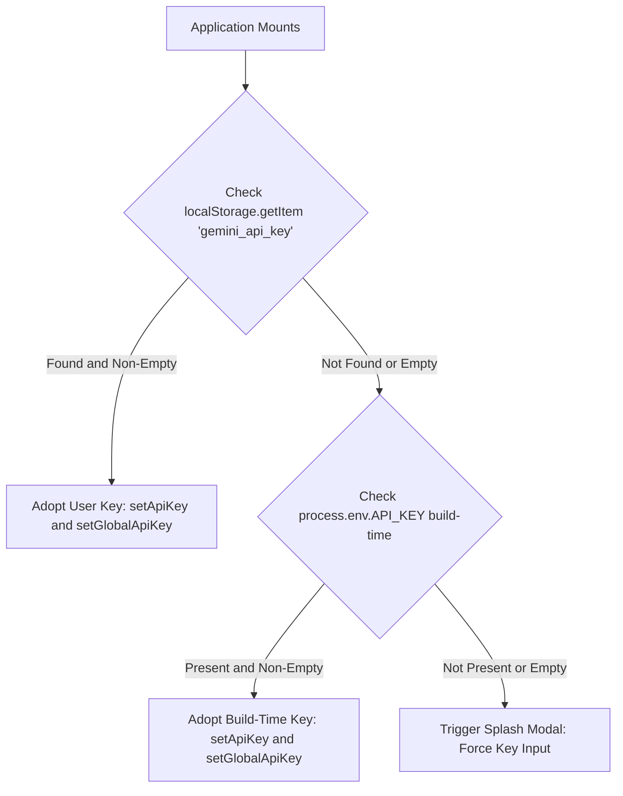

# Environment Bindings & Runtime Injection

## Overview
ExplodeIt operates in both hosted demonstration modes and decentralized Bring-Your-Own-Key (BYOK) modes. To support both paradigms seamlessly without requiring server-side secret management, Vite's build-time string substitution (`define`) is combined with browser `localStorage` evaluation at runtime.

## Vite Build-Time Binding Architecture

In `vite.config.ts`, Vite uses `loadEnv` to inspect `.env` files or system environment variables during bundling:

```typescript
export default defineConfig(({ mode }) => {
    const env = loadEnv(mode, '.', '');
    return {
      base: './',
      server: {
        port: 3000,
        host: '0.0.0.0',
      },
      plugins: [
        react(),
        tailwindcss()
      ],
      define: {
        'process.env.API_KEY': JSON.stringify(env.GEMINI_API_KEY),
        'process.env.GEMINI_API_KEY': JSON.stringify(env.GEMINI_API_KEY)
      },
      resolve: {
        alias: {
          '@': path.resolve(__dirname, '.'),
        }
      }
    };
});
```

### Key Mechanisms:
1. **`define` String Replacement**:
   - Modern browser ESM runtimes do not possess a native Node.js `process` global object.
   - Vite statically replaces occurrences of `process.env.API_KEY` and `process.env.GEMINI_API_KEY` in source code with the stringified value of `GEMINI_API_KEY` extracted at build time.
   - If no build-time variable is provided, it resolves to `""` (empty string) or `undefined`.

2. **Base Path Portability (`base: './'`)**:
   - Assets are referenced with relative pathing (`./assets/...`) rather than absolute roots (`/assets/...`).
   - Enables deployment to non-root subdirectories, including GitHub Pages (`/ExplodeIt/`) and custom reverse proxy routes, without rewriting links.

3. **Path Aliasing (`@/`)**:
   - Resolves `@` to the project root directory, facilitating clean cross-module imports.

## Runtime Key Resolution Hierarchy

When the application mounts, `App.tsx` follows a strict precedence ladder:



### Security Implications:
- User-supplied keys saved in `localStorage` take precedence over any shared build-time credentials.
- Clearing the key removes the item from `localStorage`, instantly re-triggering the splash authentication screen.
- Keys are never logged to public telemetry and are injected only into outgoing authenticated calls to `@google/genai`.
