# Client-Side Blob Lifecycle & Memory Management

## Overview
ExplodeIt is designed for prolonged client sessions where users explore dozens of objects consecutively. Because video generation (Veo 3.1 MP4) and audio synthesis (Gemini TTS WAV) generate large binary blobs stored directly in browser heap memory, unmanaged object URL allocations can result in high memory consumption and browser tab crashes. ExplodeIt introduces a deliberate asset lifecycle and revocation protocol.

## Binary Media Memory Lifecycle

```mermaid
sequenceDiagram
    participant API as External GenAI API
    participant Mem as Browser Heap Memory
    participant DOM as Audio / Video Elements
    participant Revoke as revokeGenerationAssets()

    API->>Mem: Streams Raw Base64 / MP4 Byte Stream
    Mem->>Mem: Binary conversion (Uint8Array + WAV/MP4 Header)
    Mem->>Mem: new Blob([bytes])
    Mem->>DOM: url = URL.createObjectURL(blob)
    Note over Mem,DOM: Memory pinned in browser heap until explicitly released!
    
    rect rgb(20, 30, 40)
        Note over DOM: User switches or clears history
        DOM->>Revoke: Invokes URL.revokeObjectURL(url)
        Revoke->>Mem: Unpins Blob reference
        Mem->>Mem: V8 Engine Garbage Collects Binary Data
    end
```



## Binary Asset Materialization

### 1. Video Asset Creation (`services/geminiService.ts`)
```typescript
const videoResponse = await fetch(`${downloadLink}&key=${globalApiKey}`);
const videoBlob = await videoResponse.blob();
const url = URL.createObjectURL(videoBlob);
```

### 2. Synthesized Audio WAV Construction (`services/geminiService.ts`)
Gemini TTS returns base64-encoded raw PCM audio. ExplodeIt decodes this into an unsigned 8-bit array, constructs a 44-byte RIFF/WAVE header via DataView, combines the buffers, and instantiates an audio blob:
```typescript
const binaryString = atob(base64Audio);
const len = binaryString.length;
const bytes = new Uint8Array(len);
for (let i = 0; i < len; i++) {
     bytes[i] = binaryString.charCodeAt(i);
}

const wavHeader = getWavHeader(len, 24000, 1); // 24kHz mono PCM
const wavBytes = new Uint8Array(wavHeader.length + len);
wavBytes.set(wavHeader, 0);
wavBytes.set(bytes, wavHeader.length);

const wavBlob = new Blob([wavBytes], { type: 'audio/wav' });
const url = URL.createObjectURL(wavBlob);
```

## Asset Revocation & Teardown Protocol

Browser `blob:` URLs remain pinned in memory for the life of the document unless explicitly freed with `URL.revokeObjectURL()`. ExplodeIt implements the `revokeGenerationAssets` utility:

```typescript
export const revokeGenerationAssets = (item: GenerationItem) => {
    if (item.videoUrl && item.videoUrl.startsWith('blob:')) {
        URL.revokeObjectURL(item.videoUrl);
    }
    if (item.audioUrl && item.audioUrl.startsWith('blob:')) {
        URL.revokeObjectURL(item.audioUrl);
    }
};
```

### Trigger Invariants:
1. **History Purge**: When the user clicks "Clear History" in `Sidebar.tsx`, `handleClearHistory()` iterates through all items in state and revokes their active media URLs before clearing the array:
   ```typescript
   const handleClearHistory = () => {
       history.forEach(item => revokeGenerationAssets(item));
       setHistory([]);
       setCurrentId(null);
       setStatus(GenerationStatus.IDLE);
   };
   ```
2. **Audio Track Switch Teardown**: In `DisplayArea.tsx`, a React `useEffect` listening to `item?.id` pauses and resets the existing `<audio>` DOM element reference to avoid competing audio streams and lingering element locks:
   ```typescript
   useEffect(() => {
     if (audioRef.current) {
         audioRef.current.pause();
         audioRef.current.currentTime = 0;
     }
     setIsPlaying(false);
   }, [item?.id]);
   ```
